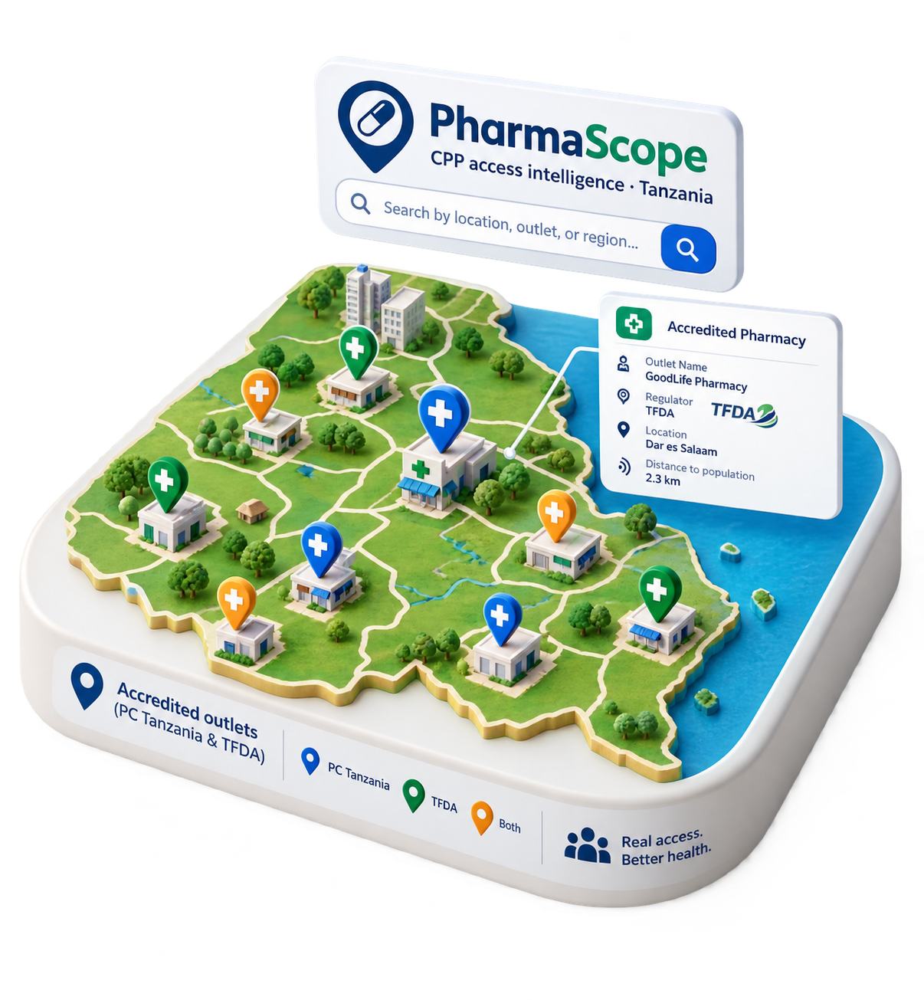

```{=html}
<link href="https://cdn.jsdelivr.net/npm/bootstrap-icons@1.11.3/font/bootstrap-icons.min.css" rel="stylesheet">
<!-- ═══════════════ HERO — data-forward split ═══════════════ -->
<section class="hero-section">
  <div class="hero-inner">

    <div class="hero-copy">
      <div class="hero-wordmark">Pharma<span>Scope</span></div>
      <span class="hero-eyebrow">CPP access intelligence · Tanzania</span>
      <h1 class="hero-title-block">
        Every <span class="accent">accredited</span><br>
        drug outlet in Tanzania,<br>
        mapped and searchable.
      </h1>
      <p class="hero-lede">
        PharmaScope turns Pharmacy Council and TFDA accreditation records into a working portal: search and filter every accredited outlet in the CPP Registry, find the nearest one to any address, screen a proposed site before it's accredited, and track the quality of the underlying data.
      </p>
      <div class="hero-ctas">
        <a href="registry.html" class="btn-primary">Open CPP Registry</a>
        <a href="about.html" class="btn-secondary">About PharmaScope</a>
      </div>
    </div>

    <div class="hero-visual">
      
    </div>

  </div>
</section>

<!-- ═══════════════ INTELLIGENCE LAYERS ═══════════════ -->
<section class="features-section">
  <div class="section-header">
    <h2>Intelligence layers</h2>
  </div>

  <div class="feature-cards">

    <div class="feature-card">
      <div class="feature-icon"><i class="bi bi-database-fill"></i></div>
      <div>
        <h3>CPP Registry Lake</h3>
        <p>Standardised accreditation data from the Pharmacy Council of Tanzania and TFDA. ~4,900 outlets across 21+ regions, harmonised from regulator source records.</p>
      </div>
      <a href="registry.html">Explore registry</a>
    </div>

    <div class="feature-card">
      <div class="feature-icon"><i class="bi bi-geo-alt-fill"></i></div>
      <div>
        <h3>Find the nearest pharmacy <span style="font-family:'JetBrains Mono',monospace;font-size:0.7rem;color:#0d9488;font-weight:500;letter-spacing:0.04em;margin-left:0.4rem;">/ LIVE</span></h3>
        <p>Enter your address, share your location, or drop a pin on the map. PharmaScope returns the closest accredited CPPs sorted by distance, with contact numbers and one-tap directions to each.</p>
      </div>
      <a href="find-pharmacy.html">Find nearest pharmacy</a>
    </div>

    <div class="feature-card">
      <div class="feature-icon"><i class="bi bi-clipboard-check-fill"></i></div>
      <div>
        <h3>Site Check: new registrations <span style="font-family:'JetBrains Mono',monospace;font-size:0.7rem;color:#0d9488;font-weight:500;letter-spacing:0.04em;margin-left:0.4rem;">/ LIVE</span></h3>
        <p>Before accrediting a new outlet, drop a pin at the proposed location and get an evidence-based saturation verdict: number of existing CPPs within walking distance, density per km<sup>2</sup>, and whether the applicant should be redirected to an under-served ward.</p>
      </div>
      <a href="find-facility.html">Open Site Check</a>
    </div>

    <div class="feature-card">
      <div class="feature-icon"><i class="bi bi-shield-check"></i></div>
      <div>
        <h3>Data Quality intelligence <span style="font-family:'JetBrains Mono',monospace;font-size:0.7rem;color:#0d9488;font-weight:500;letter-spacing:0.04em;margin-left:0.4rem;">/ LIVE</span></h3>
        <p>Every field in the CPP registry inspected for completeness: how many outlets are geocoded, which regions are under-reported, where the raw <code>.xls</code> lost information, and which fixes have the highest payoff for the next data refresh.</p>
      </div>
      <a href="data-quality.html">Inspect data quality</a>
    </div>

  </div>
</section>

<!-- ═══════════════ CTA STRIP ═══════════════ -->
<section class="countries-banner">
  <div style="max-width:1400px;margin:0 auto;">
    <h2>Start exploring</h2>
    <p>Jump straight into the CPP registry, find a nearby pharmacy, or check a proposed site.</p>
    <div style="display:flex;gap:0.75rem;flex-wrap:wrap;justify-content:center;">
      <a href="registry.html" class="btn-primary">CPP Registry</a>
      <a href="find-pharmacy.html" class="btn-secondary">Find Pharmacy</a>
      <a href="find-facility.html" class="btn-secondary">Site Check</a>
      <a href="data-quality.html" class="btn-secondary">Data Quality</a>
    </div>
  </div>
</section>
```
